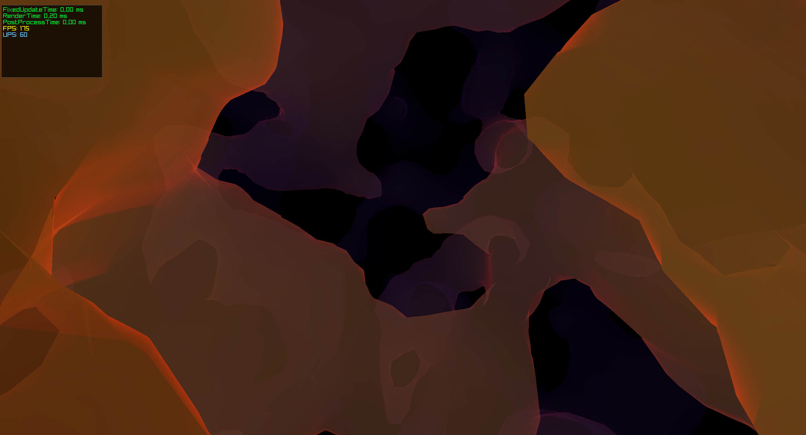

# Echo-Depths
"The deeper you go, the louder the silence."

# 3D Terrain Generation with Marching Cubes and Sonar Effect

 <!-- Replace with actual screenshot path -->

## Overview
This project generates dynamic 3D terrain using Marching Cubes algorithm combined with Perlin noise. It features a unique sonar visualization effect that reveals terrain in dark environments using custom GLSL shaders. Built with C# and Raylib.

## Key Features
- 🗻 **Procedural Terrain Generation**: Uses 3D Perlin noise to create natural-looking terrain
- ⬢ **Marching Cubes Implementation**: Efficiently converts density fields to 3D meshes
- 🌊 **Sonar Visualization**: Pulse-based shader effect reveals terrain in dark environments
- 🌫️ **Atmospheric Fog**: Depth-based fog enhances underwater atmosphere
- ⚙️ **Configurable Settings**: Adjust terrain parameters through settings file
- 📊 **Performance Monitoring**: Real-time metrics display for optimization

## Getting Started

### Prerequisites
- .NET 6 SDK
- Raylib-cs (included as submodule)

### Installation
```bash
git clone --recurse-submodules https://github.com/yourusername/echo-depths.git
cd echo-depths
dotnet run
```

### Controls
- **WASD**: Move camera
- **Mouse**: Look around
- **ESC**: Exit application

## Configuration
Modify `settings.cfg` to customize:
```ini
# Display Settings
display=0
screenWidth=0
screenHeight=0
fullscreen=false
borderlessWindowed=true

# Performance Settings
targetFPS=60
targetUPS=60
drawDistance=100.0

# Gameplay Settings
moveSpeed=3.0
rotationSpeed=3.0
mouseRotationSpeed=4.0
FOV=60.0

# Terrain Parameters
isolevel=0.25
gridSize=33
worldSize=4
perlinScale=1.0
perlinFrequency=0.1
```

## Technical Implementation

### Core Components
1. **Marching Cubes Algorithm** (`MarchingCubes.cs`)
   - Converts density fields to optimized meshes
   - Vertex caching for shared vertices
   - Smooth normal calculation

2. **Procedural Noise** (`3DPerlinNoise.cs`)
   - Classic Perlin noise implementation
   - Configurable frequency and scale
   - Seamless chunk generation

3. **Sonar Shader** (`EchoDepths.cs`)
   - Fresnel effect for edge highlighting
   - Wave propagation with smooth fading
   - Distance-based fog simulation

4. **Chunk Management** (`Chunk.cs`, `Terrain.cs`)
   - Dynamic terrain chunk loading
   - Frustum culling optimization
   - Position-based Perlin sampling

### Performance Optimization
- Vertex reuse through hash dictionary
- Chunk-based visibility culling
- Fixed timestep physics simulation
- Batched mesh rendering

## Contributing
Contributions are welcome! Please follow these steps:
1. Fork the repository
2. Create your feature branch (`git checkout -b feature/your-feature`)
3. Commit your changes (`git commit -am 'Add some feature'`)
4. Push to the branch (`git push origin feature/your-feature`)
5. Open a pull request

## License
This project is licensed under the MIT License - see the [LICENSE](LICENSE) file for details.

## Acknowledgements
- Raylib community for the excellent C# bindings
- Ken Perlin for the original noise algorithm
- Paul Bourke for Marching Cubes reference
- All contributors and testers